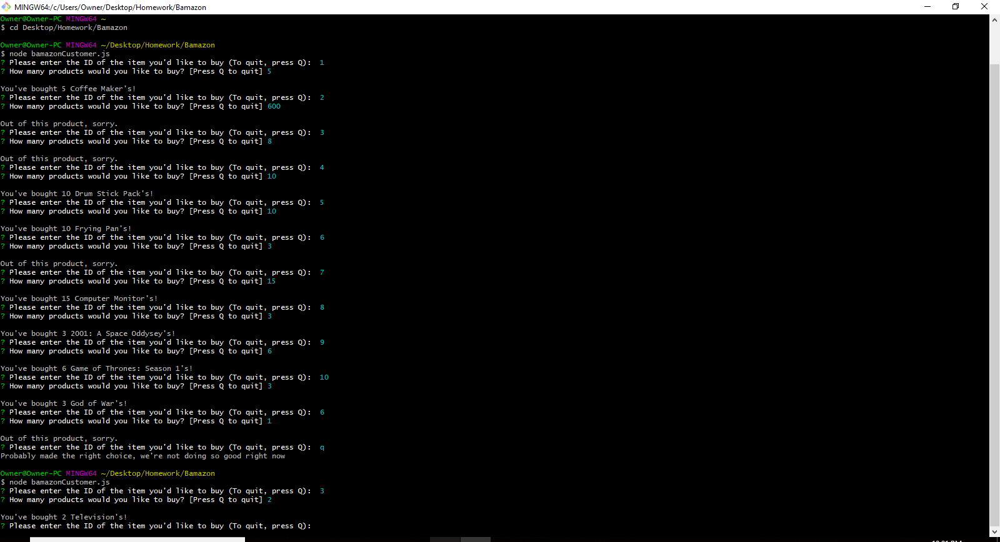
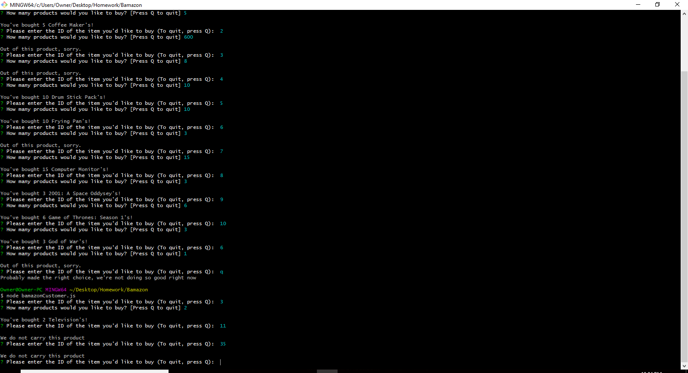

# Bamazon
Homework Assignment 10

The purpose of this program was to create a mock version of amazon, hence 'Bamazon'. It's basically an app that allows a user to purchase an item and a certain quantity of said item.
This is done by entering a product code, followed by a quantity.
If the user enters an invalid code, the program will inform the user that Bamazon does not carry that product.
If the item is out of stock or the user enters a quantity greater than what is available, the user will be informed that the product is out of stock.

The product codes are listed below, followed by the name of product, deparment, quantity and price:

'1', 'Coffee Maker', 'Kitchen Supplies', '20', '100'
'2', 'Chair', 'Decor', '35', '50'
'3', 'Television', 'Electronics', '500', '5'
'4', 'Drum Stick Pack', 'Musical Instruments', '35', '40'
'5', 'Frying Pan', 'Kitchen Supplies', '15', '100'
'6', 'Rug', 'Decor', '40', '0'
'7', 'Computer Monitor', 'Electronics', '225', '20'
'8', '2001: A Space Oddysey', 'Books', '20', '10'
'9', 'Game of Thrones: Season 1', 'Movies', '80', '500'
'10', 'God of War', 'Video Games', '60', '200'

